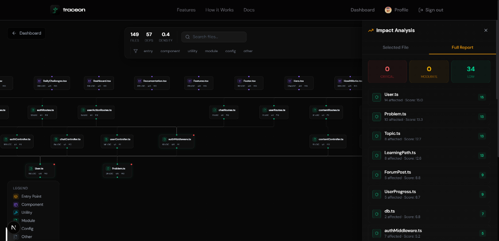

<div align="center">


# Traceon

**See what your codebase really looks like.**

[](https://nextjs.org/)
[](https://typescriptlang.org/)
[](https://mongodb.com/)
[](https://tailwindcss.com/)
[](https://reactflow.dev/)
[](LICENSE)

[Features](#features) · [Getting Started](#getting-started) · [Architecture](#architecture) · [API Reference](#api-reference) · [Roadmap](#roadmap)

[Live Demo](https://traceon.vercel.app) · [Report Bug](https://github.com/Rishabhworkspace/Traceon/issues) · [Request Feature](https://github.com/Rishabhworkspace/Traceon/issues)

</div>

## About

Traceon is an interactive codebase analysis tool that clones any GitHub repository, parses every source file into an Abstract Syntax Tree, builds a full dependency graph, and renders it as a real-time force-directed visualization — all inside your browser.

Paste a GitHub URL. Get a visual map of every file, every import, every connection. Know exactly which module is a critical dependency before it breaks your sprint.

<div align="center">
  
  <br />
  <sub>Interactive dependency graph with impact analysis panel</sub>
</div>

## Features

- **AST-powered analysis** — Uses the TypeScript Compiler API for proper AST parsing, not regex or string matching.
- **Interactive dependency graph** — Force-directed graph with zoom, pan, search, and filter via React Flow. Nodes are color-coded by type.
- **Traceon AI (Codebase Chat)** — Directly chat with your codebase architecture. Ask questions about component relationships, get refactoring suggestions, and auto-generate architecture summaries.
- **Time Travel & Architectural Diffs** — View the graph at different commit hashes. See visual diffs (red/green edges) showing how dependencies evolved over time.
- **Monorepo / Workspace Support** — Visualize dependencies intelligently across packages in enterprise monorepos (Turborepo, Nx, Lerna).
- **High-Resolution & HTML Exports** — Export your graph as PNG, SVG, PDF, or a standalone interactive static HTML viewer for wikis/Notion.
- **Impact analysis engine** — Select any file to see its impact score (0–100), risk level, direct/transitive dependents, and visual blast radius.
- **Circular dependency detection** — Automatically flags `A → B → C → A` loops that cause build issues.
- **Dashboard & metrics** — Track analyzed repositories, file counts, dependency density, critical modules, and architectural heatmaps.
- **Multiple ingestion methods** — Paste a GitHub URL or upload a ZIP archive.
- **Authentication** — Email/password, GitHub OAuth, Google OAuth, JWT sessions, and guest mode.

## Getting Started

### Prerequisites

- **Node.js** ≥ 18
- **npm** ≥ 9
- **MongoDB Atlas** cluster (free tier works)
- **Git** installed locally

### Setup

```bash
git clone https://github.com/Rishabhworkspace/Traceon.git
cd Traceon
npm install
cp .env.example .env.local
```

Edit `.env.local` with your credentials:

```env
# Database
MONGODB_URI=mongodb+srv://<user>:<password>@<cluster>.mongodb.net/traceon

# NextAuth
NEXTAUTH_SECRET=your_random_secret_minimum_32_chars
NEXTAUTH_URL=http://localhost:3000

# GitHub OAuth
GITHUB_ID=your_github_oauth_app_id
GITHUB_SECRET=your_github_oauth_app_secret

# Google OAuth
GOOGLE_CLIENT_ID=your_google_client_id
GOOGLE_CLIENT_SECRET=your_google_client_secret
```

> [!TIP]
> Generate a secure secret with `openssl rand -base64 32`

### Run

```bash
npm run dev
```

Open [http://localhost:3000](http://localhost:3000) — you're live.

## Architecture

```
┌─────────────────────────────────────────────────────────────┐
│                        Client (React)                       │
│  Landing Page → Analysis UI → Graph Viewer → Dashboard      │
├─────────────────────────────────────────────────────────────┤
│                     Next.js App Router                      │
│  Server Components │ API Routes │ Server Actions            │
├─────────────────────────────────────────────────────────────┤
│                     Analysis Pipeline                       │
│  Clone → Scan → Parse (Worker Threads) → Build Graph        │
├─────────────────────────────────────────────────────────────┤
│                        Data Layer                           │
│  MongoDB Atlas │ Mongoose ODM │ Connection Pooling           │
└─────────────────────────────────────────────────────────────┘
```

### Analysis pipeline

1. **Clone** — `simple-git` clones the repo to a temp directory.
2. **Scan** — Walk the file tree, filter source files, ignore `node_modules`.
3. **Parse** — Spawn worker threads for parallel AST parsing via the TypeScript Compiler API. Extract imports, exports, functions, classes, and LOC.
4. **Build graph** — Resolve import paths into nodes + edges. Calculate dependency density, in/out degree, and critical modules. Detect circular dependencies via DFS.
5. **Visualize** — Render with React Flow using Dagre layout, custom color-coded nodes, animated edges, and interactive inspection panels.

### Impact scoring

The impact engine uses reverse BFS traversal to calculate how much damage a change to any file could cause:

| Risk Level | Score | Meaning |
|-----------|-------|---------|
| Critical | 60–100 | Changing this file breaks many things |
| Moderate | 30–59 | Proceed with caution |
| Low | 0–29 | Safe to modify |

## Tech Stack

| Layer | Technology | Why |
|-------|-----------|-----|
| Framework | Next.js 16 (App Router) | Server Components, API routes, streaming |
| Language | TypeScript 5 | Type safety across the full stack |
| Styling | Tailwind CSS v4 | CSS-first config, custom design tokens |
| Graph | React Flow (@xyflow/react) | Best-in-class graph rendering |
| Layout | Dagre | Hierarchical graph layout algorithm |
| Database | MongoDB Atlas + Mongoose | Flexible document model for graph data |
| Auth | NextAuth.js | GitHub, Google, Credentials providers |
| Parsing | TypeScript Compiler API | Production-grade AST parsing |
| Cloning | simple-git | Lightweight Git operations |
| Animation | Framer Motion | Physics-based UI animations |
| Icons | Lucide React | Clean, consistent icon set |

## Project Structure

```
src/
├── app/                        # Next.js App Router pages & API routes
│   ├── page.tsx                # Landing page
│   ├── analyze/                # Analysis progress UI
│   ├── dashboard/              # User dashboard (protected)
│   ├── graph/[repoId]/         # Interactive graph viewer
│   └── api/                    # REST endpoints
│
├── components/
│   ├── graph/                  # Graph visualization (CustomNode, ImpactPanel, etc.)
│   ├── home/                   # Landing page sections
│   ├── dashboard/              # Dashboard widgets
│   └── layout/                 # Navbar, Footer, ErrorBoundary
│
├── lib/
│   ├── analyzer/               # Clone, scan, parse, pipeline orchestration
│   │   └── graph/              # Graph builder + impact scoring
│   ├── auth.ts                 # NextAuth configuration
│   └── db/                     # MongoDB connection + Mongoose models
│
└── workers/
    └── parse-worker.js         # Worker thread for CPU-intensive parsing
```

## API Reference

| Method | Endpoint | Auth | Description |
|--------|---------|------|-------------|
| `POST` | `/api/analyze` | Optional | Start repository analysis |
| `POST` | `/api/analyze/upload` | Optional | Upload ZIP for analysis |
| `GET` | `/api/graph/:repoId` | Session | Fetch graph data |
| `GET` | `/api/impact/:repoId` | Session | Fetch impact analysis |
| `GET` | `/api/dashboard` | Required | User dashboard data |
| `GET` | `/api/repository/:id` | Session | Repository status |
| `POST` | `/api/auth/signup` | Public | User registration |
| `GET` | `/api/user/profile` | Required | Get user profile |
| `PUT` | `/api/user/profile` | Required | Update user profile |

## Deployment

### Vercel (Recommended)

1. Push to GitHub
2. Import project in [Vercel Dashboard](https://vercel.com/new)
3. Add environment variables in project settings
4. Deploy — Vercel auto-detects Next.js

> [!IMPORTANT]
> Whitelist `0.0.0.0/0` in MongoDB Atlas Network Access for Vercel's dynamic IPs.

## Roadmap

- [x] Repository cloning & file scanning
- [x] TypeScript AST parsing with Worker Threads
- [x] Dependency graph construction & rendering
- [x] Impact analysis engine
- [x] User dashboard with metrics
- [x] GitHub & Google OAuth
- [x] ZIP upload support
- [x] Circular dependency detection
- [x] Traceon AI (Codebase chat & refactoring suggestions)
- [x] Time-travel architectural commit history & diffs
- [x] Monorepo & workspace graph visualization
- [x] Export graph as PNG/SVG/PDF and Interactive HTML
- [ ] VS Code extension
- [ ] Multi-language support (Python, Go, Rust)
- [ ] Team collaboration features

---

<div align="center">

**Built by [Rishabh](https://github.com/Rishabhworkspace)**

*Traceon — Because understanding your code shouldn't require reading all of it.*

</div>