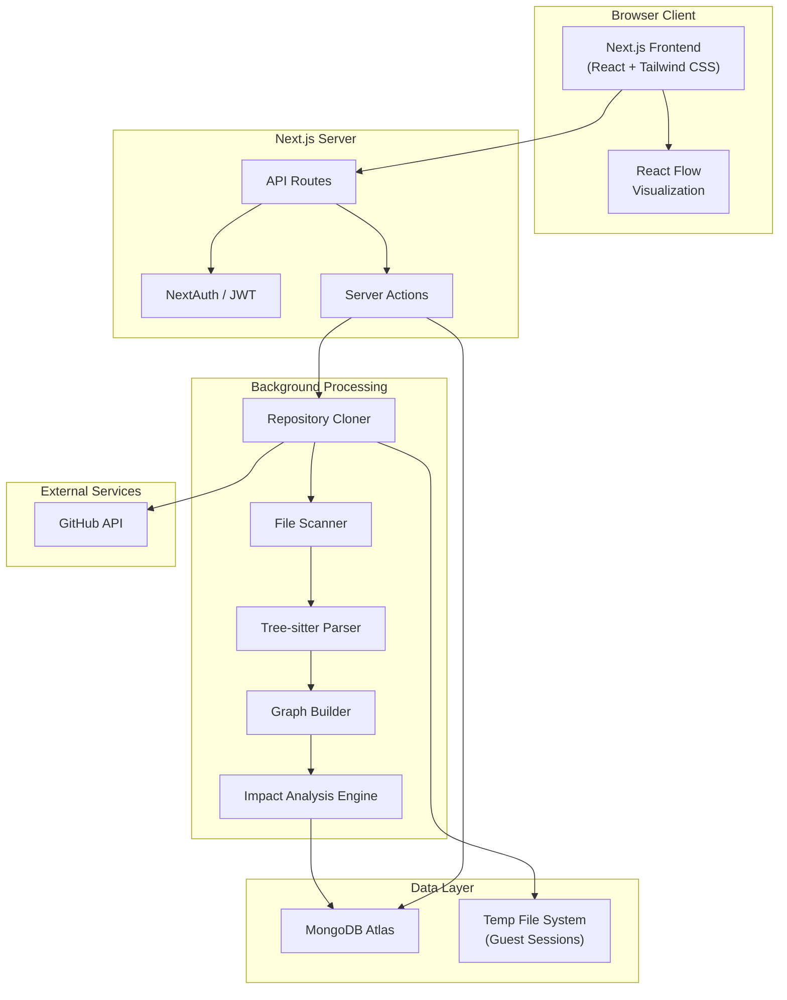
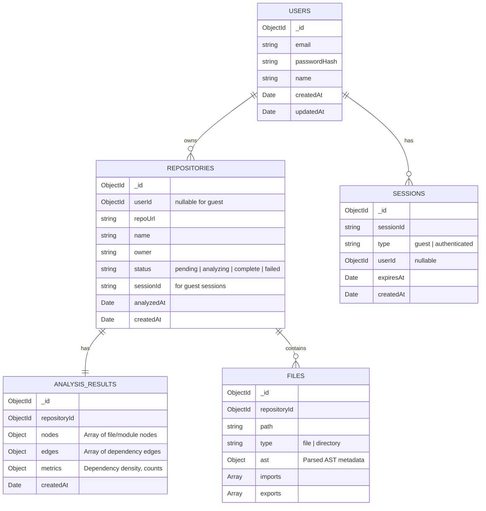
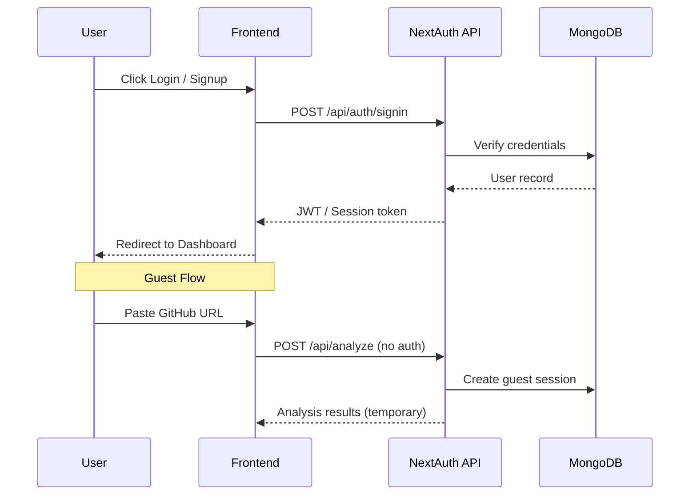
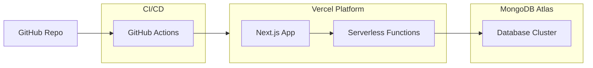

# Traceon — System Architecture

> **Version:** 1.0  
> **Date:** March 2, 2026  

---

## 1. Architecture Overview

Traceon is a **Next.js fullstack monolith** with background processing capabilities. The frontend and backend coexist in a single deployable unit, with computationally intensive tasks offloaded to Node.js Worker Threads.



---

## 2. Technology Stack

| Layer | Technology | Purpose |
|---|---|---|
| **Frontend** | Next.js (React + TypeScript) | UI rendering, routing, SSR |
| **Styling** | Tailwind CSS | Utility-first responsive design |
| **Visualization** | React Flow | Interactive dependency graphs |
| **Backend** | Next.js API Routes / Server Actions | REST API, business logic |
| **Authentication** | NextAuth.js / JWT | Session management, auth flows |
| **Code Parsing** | Tree-sitter (WASM) | AST generation for JS/TS files |
| **Database** | MongoDB (Atlas) | Persistent data storage |
| **Background Jobs** | Node.js Worker Threads | CPU-intensive parsing tasks |
| **Deployment** | Vercel + MongoDB Atlas | Hosting and database |
| **CI/CD** | GitHub Actions | Automated testing and deployment |

---

## 3. Directory Structure (Planned)

```
traceon/
├── public/                    # Static assets
├── src/
│   ├── app/                   # Next.js App Router pages
│   │   ├── (auth)/            # Auth pages (login, signup)
│   │   ├── dashboard/         # Analysis dashboard
│   │   ├── analyze/           # Repository analysis page
│   │   ├── graph/             # Graph visualization page
│   │   └── api/               # API route handlers
│   │       ├── auth/          # Auth endpoints
│   │       ├── analyze/       # Analysis endpoints
│   │       ├── repository/    # Repository CRUD
│   │       └── graph/         # Graph data endpoints
│   ├── components/            # React components
│   │   ├── ui/                # Base UI components
│   │   ├── layout/            # Layout components
│   │   ├── graph/             # Graph visualization components
│   │   ├── dashboard/         # Dashboard widgets
│   │   └── auth/              # Auth forms
│   ├── lib/                   # Core libraries
│   │   ├── db/                # Database connection & models
│   │   ├── auth/              # Auth configuration
│   │   ├── analyzer/          # Analysis pipeline
│   │   │   ├── cloner.ts      # Repository cloning
│   │   │   ├── scanner.ts     # File discovery
│   │   │   ├── parser.ts      # Tree-sitter AST parsing
│   │   │   ├── graph.ts       # Graph construction
│   │   │   └── impact.ts      # Impact analysis
│   │   └── utils/             # Shared utilities
│   ├── hooks/                 # Custom React hooks
│   ├── types/                 # TypeScript type definitions
│   └── styles/                # Global styles
├── workers/                   # Worker thread scripts
├── .env.local                 # Environment variables
├── next.config.ts             # Next.js configuration
├── tailwind.config.ts         # Tailwind configuration
├── tsconfig.json              # TypeScript configuration
└── package.json
```

---

## 4. Data Layer

### 4.1 MongoDB Collections



### 4.2 Node & Edge Schema

**Node (within analysis_results.nodes):**
```json
{
  "id": "src/utils/helpers.ts",
  "label": "helpers.ts",
  "type": "module",
  "path": "src/utils/helpers.ts",
  "imports": ["lodash", "./constants"],
  "exports": ["formatDate", "parseInput"],
  "loc": 145,
  "complexity": "low"
}
```

**Edge (within analysis_results.edges):**
```json
{
  "source": "src/app/page.tsx",
  "target": "src/utils/helpers.ts",
  "relationship": "imports",
  "weight": 2
}
```

---

## 5. Analysis Pipeline


**Stage Details:**

| Stage | Description | Technology |
|---|---|---|
| Clone | `git clone` target repo into temp directory | `simple-git` |
| Scan | Walk directory tree, filter by extensions | Node.js `fs` |
| Parse | Generate AST for each JS/TS file | Tree-sitter WASM |
| Extract | Find import/export/call relationships | AST traversal |
| Build | Construct graph nodes and edges | Custom graph engine |
| Impact | Reverse traversal for change propagation | BFS/DFS algorithms |
| Store | Persist to MongoDB or temp storage | Mongoose ODM |
| Serve | Return graph data to frontend | Next.js API |

---

## 6. Authentication Flow



---

## 7. Deployment Architecture



| Component | Service | Tier |
|---|---|---|
| Frontend + API | Vercel | Hobby / Pro |
| Database | MongoDB Atlas | Free (M0) / Shared |
| CI/CD | GitHub Actions | Free tier |
| Domain | Custom domain via Vercel | Optional |

---

## 8. Security Architecture

| Concern | Mitigation |
|---|---|
| Repository cloning | Sandboxed temp directories, auto-cleanup |
| User input | URL validation, path sanitization |
| Authentication | Hashed passwords, JWT with expiry |
| API access | Protected routes, session-based authorization |
| Guest data | Isolated temp storage, TTL-based expiration |
| Rate limiting | API rate limits to prevent abuse |
